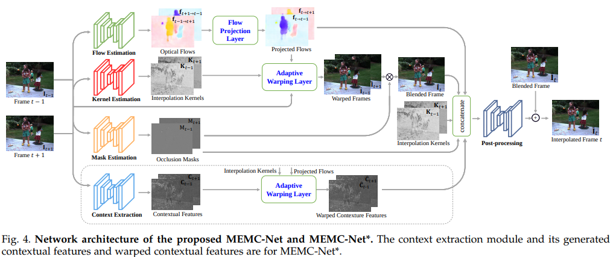

# Video Frame Interpolation
[Papers with Code: video-frame-interpolation](https://paperswithcode.com/task/video-frame-interpolation)

## Learning Image Matching by Simply Watching Video (ECCV 2016)
[Learning Image Matching by Simply Watching Video](https://arxiv.org/abs/1603.06041)  
convolution encoder-decoder

## Deep Voxel Flow (ICCV 2017)
[Video Frame Synthesis using Deep Voxel Flow](https://arxiv.org/abs/1603.06041)  
> **voxel flow** layer: a **per-pixel, 3D optical flow vector across space and time** in the input video. The final pixel is generated by trilinear interpolation across the input video volume (which is typically just two frames). Thus, for video interpolation, the final output pixel can be a blend of pixels from the previous and next frames. This voxel flow layer is similar to an optical flow field. However, it is only an intermediate layer, and its correctness is never directly evaluated. Thus, our method requires no optical flow supervision, which is challenging to produce at scale.

## PWC-Net (CVPR 2018)
[PWC-Net: CNNs for Optical Flow Using Pyramid, Warping, and Cost Volume](https://arxiv.org/abs/1709.02371) by Nvidia  

## MEMC-Net (TPAMI 2018)
[Motion Estimation and Motion Compensation Driven Neural Network for Video Interpolation and Enhancement](https://arxiv.org/abs/1810.08768) from Shanghai Jiao Tong University
  

## DAIN (CVPR 2019)
[**D**epth-**A**ware Video Frame **In**terpolation](https://arxiv.org/pdf/1904.00830v1.pdf) from Shanghai Jiao Tong University    
[pyTorch code](https://github.com/baowenbo/DAIN) | [Papers with Code](https://paperswithcode.com/paper/depth-aware-video-frame-interpolation)  
based on [MEMC-Net](#memc-net-tpami-2018)  
##### testing pre-trained model
GTX 1080 Ti 1280x720 about 2s per frame  
issue: drifting inwards  
[jmspiewak](https://github.com/baowenbo/DAIN/issues/51) said it is because of anomaly in the pretrained PWCNet model. The workaround of jmspiewak seems fix the issue. Need to study more about PWCNet
memory...is it possible to put some branch to another GPU?

## Zooming-Slow-Mo (CVPR-2020)
[Zooming Slow-Mo: Fast and Accurate One-Stage Space-Time Video Super-Resolution](https://arxiv.org/abs/2002.11616)  
[pyTorch](https://github.com/Mukosame/Zooming-Slow-Mo-CVPR-2020)  
video frame interpolation (VFI) and video super-resolution (VSR), i.e. temporal interpoliation and spatial super-resolution are intra-related. This paper propose a unified one-stage STVSR framework to handle 2 tasks simultaneously.
1. temporally interpolate LR frame features in missing LR video frames capturing **local temporal contexts** by the proposed feature temporal interpoliation network
2. propose a **deformable ConvLSTM** to align and aggregate temporal information simultaneously for better leveraging global temporal contexts. ref: [DCNv2](/CNN/models.html#dcnv2-cvpr-2019)
3. a deep reconstruction network is adopted to predict HR slow-motion video frames

<iframe width="1280" height="720" src="https://www.youtube.com/embed/8mgD8JxBOus" frameborder="0" allow="accelerometer; autoplay; encrypted-media; gyroscope; picture-in-picture" allowfullscreen></iframe>
##### testing pre-trained model
used 6m to process 360x640 120 frames -> 1440x2560 238 frames on GTX 1080 Ti