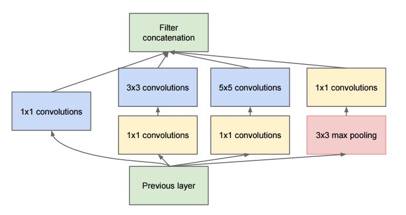

### Inception v1
[Going Deeper with Convolutions (ILSVRC 2014)](https://arxiv.org/abs/1409.4842)  
By adding auxiliary classifiers connected to these intermediate layers, we would expect to encourage discrimination in the lower stages in the classifier, increase the gradient signal that gets propagated back, and provide additional regularization.

Application: GoogLeNet
### Inception v2
[Batch Normalization: Accelerating Deep Network Training by Reducing Internal Covariate Shift (ICML 2015)](https://arxiv.org/abs/1502.03167), 
[normalization/batch normalization](/basic/normalization.html#batch-normalization-icml-2015)
### Inception v3
[Rethinking the Inception Architecture for Computer Vision (CVPR 2016)](https://www.cv-foundation.org/openaccess/content_cvpr_2016/papers/Szegedy_Rethinking_the_Inception_CVPR_2016_paper.pdf)
#### Factorizing Convolutions with Large Filter Size
##### Factorization into smaller convolutions
computation of conv 5x5 > 3x3+3x3
##### Spatial Factorization into Asymmetric Convolutions 
3x3 > 3x1+1x3
#### Rethinking the Utility of Auxiliary Classifiers
Auxiliary classifiers did not improve convergence early in the training. Near the end of training, the network with the auxiliary branches starts to overtake the accuracy of the network without any auxiliary branch and reaches a slightly higher plateau.
The hypothesis of v1 that auxiliary classifier help evolving the low-level features is most likely misplaced. Auxiliary classifiers act as regularizer.
### Inception v4, Inception-ResNet
[Inception-v4, Inception-ResNet and the Impact of Residual Connections on Learning (AAAI 2017)](http://arxiv.org/pdf/1602.07261.pdf)
#### Pure Inception blocks
keep tuning...
#### residual scaling
stabilize training, prevent network died early. scale down the residual before element-wise sum with scale 0.1~0.3 
Note: In other words, enforce the residual block learn x3~10 of residual value. It is how residual scaling avoid died?
