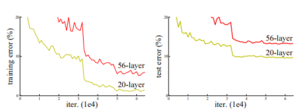

# CNN

## Concept
### Image Convolution

### Weighting Sharing
### Receptive Field
[VGG](#vgg-iclr-2014)
### Pooling
### Downscale
stride, pooling or resize
less computation required 
get high level features
#### Stride vs pooling
---------
|stride|pooling|
|---|--|-----|
computation|less|4 times more computation+pooling operate
gradient propagation|bad|better
upscale|
could propagate with pooling indice
### Upscale / Up-sampling
used for 1. reverse downscale, 2. increase resolution  
usually required for pix 2 pix application, e.g. segmentation, super-resolution
#### Methods:
1. resize  
resampling and interpolation
2. un-pooling (if pooling is used) [Deconvnet](#deconvnet-iccv-2015)
3. Transposed Convolution (deconvolution)
4. [PixelShuffle](#pixelshuffle-cvpr-2016)
### 1x1 convolution
could be used for changing the number of features
see [Inception (ILSVRC 2014)](#inception-ilsvrc-2014), 
[ACNet: Strengthening the Kernel Skeletons for Powerful CNN via Asymmetric Convolution Blocks (ICCV 2019)](https://arxiv.org/abs/1908.03930)

## Main

### LeNet-5 (1998)
[Gradient-Based Learning Applied to Document Recognition](http://www.dengfanxin.cn/wp-content/uploads/2016/03/1998Lecun.pdf)

### AlexNet (2012)
ReLu: solve vanishing gradient, training process faster  
dropout: solve overfitting  
[ImageNet Classification with Deep Convolutional Neural Networks](https://papers.nips.cc/paper/4824-imagenet-classification-with-deep-convolutional-neural-networks.pdf)
### VGG (ICLR 2014)
[Very Deep Convolutional Networks for Large-Scale Image Recognition](https://arxiv.org/abs/1409.1556)  
replace large kernel by mult. small kernels  
receptive field of 3x3+3x3 = 5x5  
parameters 18 < 25  
the network loss to inception, but the pretrained network is useful for image feature embedding  
### Inception (ILSVRC 2014)
[Going Deeper with Convolutions](https://arxiv.org/abs/1409.4842)  
1. approximate sparse CNN/ dimension reductions.  
e.g. 192x25x32 ⇒ 192x1x16+16x25x32
2. avg. pooling

Application: GoogLeNet
### ResNet (2015, CVPR 2016)
Residual Network  
[Deep Residual Learning for Image Recognition](https://arxiv.org/abs/1512.03385)

preserve information, learning details
also solve 	1. vanishing gradient
            2. Degradation problem
#### Degradation problem
deeper network give higher train & test error than shallover network

### U-Net (2015)
[U-Net: Convolutional Networks for Biomedical Image Segmentation](https://arxiv.org/abs/1505.04597)
An encoder-decoder architecture with skip-connections that forward the output of encoder layer directly to the input of the corresponding decoder layer through channel-wise concatenation.

#### ResNet vs U-Net
Both are method to skip connection
ResNet|U-Net
---|---
short connection usually|long connection usually 
element-wise sum|concatenation
channel remain the same|channel increase when concatentation (feature duplicated)
keep w,h/ resolution|down-scaling in-between, upscale before concatentation

### DeconvNet (ICCV 2015)
[Learning deconvolution network for semantic segmentation](https://arxiv.org/abs/1505.04366)
**unpooling**: use the max locations of the encoder feature maps (pooling indices) to perform non-linear upsampling in the decoder network  
**deconvolution**: convolution transpose  
also used in Visualizing and understanding convolutional networks (ECCV 2014)

### PixelShuffle (CVPR 2016)
[Real-Time Single Image and Video Super-Resolution Using an Efficient Sub-Pixel Convolutional Neural Network](https://arxiv.org/abs/1609.05158)

### Let there be Color! - fusing global feature (2016)
[Let there be Color! (2016)](https://docs.google.com/document/d/19T7L1ZXNq-WNtDqxcaZ8wnb2UXTR8JdaXygqxZS3ifQ/edit#heading=h.z65vuhjc76me)
fusion layer  
usually used for global feature

### DenseNet (2017)
[Densely Connected Convolutional Networks](https://arxiv.org/abs/1608.06993)
connect to previous layer with concatenation (rather than sum)  
adv: 		Do not require data augmentation  
disadv: 	higher memory requirement  

### CapsuleNet (2017)
[Dynamic Routing Between Capsules](https://arxiv.org/abs/1710.09829)
For dynamic routing
vector to vector instead of scalar to scalar

## Topics
* [Object Detection](/CNN/object_detection/index.md)
* [Image Translation](/CNN/image_translation/index.md)
    * [Denoising]
    * [Super-resolution]
    * [Colorization]
    * [Inpaint]
    * [Style Transfer]
    * [HDR] ( Bit depth expansion)
    
* [OCR (Optical character recognition)] (Image->text translation)