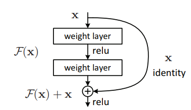

# CNN Models

## LeNet-5 (1998)
[Gradient-Based Learning Applied to Document Recognition](http://www.dengfanxin.cn/wp-content/uploads/2016/03/1998Lecun.pdf)

## AlexNet (NIPS 2012)
ReLu: solve vanishing gradient, training process faster  
dropout: solve overfitting  
LRN: normalization
[ImageNet Classification with Deep Convolutional Neural Networks](https://papers.nips.cc/paper/4824-imagenet-classification-with-deep-convolutional-neural-networks.pdf)
### Local Response Normalization
[Normalization/LRN](/basic/normalization.html#local-response-normalization-nips-2012)

## VGG (ICLR 2014)
[Very Deep Convolutional Networks for Large-Scale Image Recognition](https://arxiv.org/abs/1409.1556)  
replace large kernel by mult. small kernels  
receptive field of 3x3+3x3 = 5x5  
parameters 18 < 25  
the network loss to inception, but the pretrained network is useful for image feature embedding  

## Inception (ILSVRC 2014)
[Going Deeper with Convolutions](https://arxiv.org/abs/1409.4842)  
1. approximate sparse CNN/ dimension reductions.  
e.g. 192x25x32 ⇒ 192x1x16+16x25x32
2. avg. pooling

Application: GoogLeNet

## STN(CVPR 2015) 
[Spatial Transformer Networks](https://arxiv.org/abs/1506.02025)

## U-Net (MICCAI 2015)
[U-Net: Convolutional Networks for Biomedical Image Segmentation](https://arxiv.org/abs/1505.04597)
An encoder-decoder architecture with skip-connections that forward the output of encoder layer directly to the input of the corresponding decoder layer through channel-wise concatenation.

## ResNet (CVPR 2016)
Residual Network  
[Deep Residual Learning for Image Recognition](https://arxiv.org/abs/1512.03385)

preserve information, learning details
also solve 	1. vanishing gradient
            2. Degradation problem
### Degradation problem
deeper network give higher train & test error than shallover network

### ResNet vs U-Net
Both are method to skip connection
ResNet|U-Net
---|---
short connection usually|long connection usually 
element-wise sum|concatenation
channel remain the same|channel increase when concatentation (feature duplicated)
keep w,h/ resolution|down-scaling in-between, upscale before concatentation

## DeconvNet (ICCV 2015)
[Learning deconvolution network for semantic segmentation](https://arxiv.org/abs/1505.04366)
**unpooling**: use the max locations of the encoder feature maps (pooling indices) to perform non-linear upsampling in the decoder network  
**deconvolution**: convolution transpose  
also used in Visualizing and understanding convolutional networks (ECCV 2014)

## PixelShuffle (CVPR 2016)
[Real-Time Single Image and Video Super-Resolution Using an Efficient Sub-Pixel Convolutional Neural Network](https://arxiv.org/abs/1609.05158)

## Fusing global feature
[Let there be Color! (2016)](/CNN/img2img/colorization#let-there-be-color-siggraph-2016)
fusion layer  
usually used for global feature

## DenseNet (CVPR 2017)
[Densely Connected Convolutional Networks](https://arxiv.org/abs/1608.06993)
connect to previous layer with concatenation (rather than sum)  
adv: 		Do not require data augmentation  
disadv: 	higher memory requirement  

## CapsuleNet (2017)
[Dynamic Routing Between Capsules](https://arxiv.org/abs/1710.09829)
For dynamic routing
vector to vector instead of scalar to scalar

## Deformable ConvNet
### DCNv1 (ICCV 2017)
[Deformable Convolutional Networks](http://openaccess.thecvf.com/content_ICCV_2017/papers/Dai_Deformable_Convolutional_Networks_ICCV_2017_paper.pdf)  
 from MSRA  
### DCNv2 (CVPR 2019)
[Deformable ConvNets v2: More Deformable, Better Results](https://arxiv.org/abs/1811.11168) from MSRA  

## Deep Layer Aggregation, DLA (CVPR 2018)
[Deep Layer Aggregation](https://arxiv.org/abs/1707.06484)  
image classification network with hierarchical skip connections

## CSPNet (2019)
[CSPNet: A New Backbone that can Enhance Learning Capability of CNN](https://arxiv.org/abs/1911.11929v1)  
[Darknet code](https://github.com/WongKinYiu/CrossStagePartialNetworks) | 
[AlexeyAB darknet](https://github.com/AlexeyAB/darknet/issues/4406)  

## Light-weights models
* [Light-weights model](/CNN/light-weight_models.md)