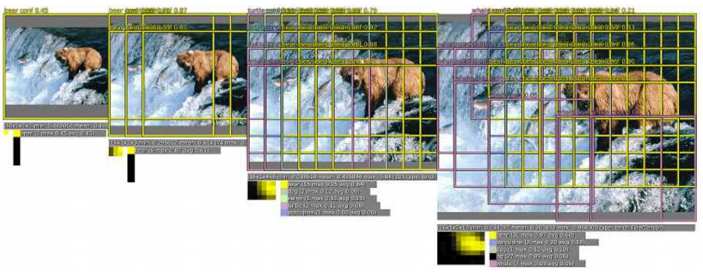

# Object Detection
## OverFeat (ILSVRC 2013)
[OverFeat: Integrated Recognition, Localization and Detection using Convolutional Networks](https://arxiv.org/abs/1312.6229)  
sliding windows + feature Extractor + multi-scale Classification

## R-CNN (CVPR 2014)
[Rich feature hierarchies for accurate object detection and semantic segmentation](https://arxiv.org/abs/1311.2524)  
Regions with CNN features  
1. generate region proposals by _Selective Search_, warpped to fixed size
2. embedding (one shot) features with CNN
3. detect & classify object by SVM
4. *adjust boundary box* by linear regression
### Bounding-Box Regression
``$`P=(P_x, P_y, P_w, P_h)`$``: the pixel corrdinates of the center of proposal together with width and height  
``$`G=(G_x, G_y, G_w, G_h)`$``: the ground-truth  
``$`\hat{G}`$``: predicted ground-truth  
``$`d_x(P), d_y(P)`$``: scale-invariant translation of P_x, P_y  
``$`d_w(P), d_h(P)`$``: log-space translation of P_w, P_h  
```math
\begin{split}
&\hat{G}_x=P_wd_x(P)+P_x\\
&\hat{G}_y=P_hd_y(P)+P_y\\
&\hat{G}_w=P_we^{d_w(P)}\\
&\hat{G}_h=P_he^{d_h(P)}
\end{split}
```
### Selective Search
[Selective Search for Object Recognition](http://www.huppelen.nl/publications/selectiveSearchDraft.pdf)  
Hierarchical Grouping Algorithm, merge from small segment to large proposal

## Spatial Pyramid Pooling, SPP-net (TPAMI 2015)
[Spatial Pyramid Pooling in Deep Convolutional Networks for Visual Recognition](https://arxiv.org/abs/1406.4729)  
Previous model require a fixed-size input image.  
*spatial pyramid pooling layer* get fixed size output from flexible size input  
Improve _Bag-of-Words (BoW)_ to maintain *spatial infomation* by pooling in _local spatial bins_. These spatial bins have sizes proportional to the image size, so the number of bins is fixed regardless of the image size.

## Fast R-CNN (ICCV 2015)
[Fast R-CNN](https://arxiv.org/abs/1504.08083)
R-CNN, SPP drawbacks:
>>> Training is a multi-stage pipeline that involves extracting features, fine-tuning a network with log loss, training SVMs. Fine-tuning algorithm cannot update the CNN that precede spatial pyramid pooling.  
Fast R-CNN: using fully connected classifer so it could also train the CNN features.  
Contributions:  
* Training is single-stage, using a multi-task loss
* Training can update all network layers

1. generate region proposals by _Selective Search_
2. embedding (one shot) features with CNN with flexible size input
3. bounding box regression
4. classification with fully connnected network
*RoI Pooling* :  
>>> The RoI layer is simply the special-case of the spatial pyramid pooling layer used in SPPnets in which there is only one pyramid level.

## Faster R-CNN (2015)

### Region Proposal Network (RPN)
An RPN is a fully convolutional network that simultaneously predicts object bounds and objectness scores at each position with *anchor*. 
(RPN replace selective search to produce region proposal.)  

>>To generate region proposals, we slide a small network over the convolutional feature map output by the last shared convolutional layer. This small network takes as input an n × n spatial window of the input convolutional feature map. Each sliding window is mapped to a lower-dimensional feature (256-d for ZF and 512-d for VGG, with ReLU following). This feature is fed into two sibling fullyconnected layers—a box-regression layer (reg) and a box-classification layer (cls).
It shares full-image convolutional features with the detection network, thus enabling nearly cost-free region proposals.  
#### Anchors
>>At each sliding-window location, we simultaneously
predict multiple region proposals, where the number
of maximum possible proposals for each location is
denoted as k. So the reg layer has 4k outputs encoding
the coordinates of k boxes, and the cls layer outputs
2k scores that estimate probability of object or not
object for each proposal


## UnitBox (ACM MM 2016)
[UnitBox: An Advanced Object Detection Network](https://arxiv.org/abs/1608.01471)
* introduce a novel *Intersection over Union (IoU) loss function*
* adopts a fully convolutional network architecture, to predict the object bounds as well as the *pixel-wise classification scores* on the feature maps directly.

## SSD (ECCV 2016)
[SSD: Single Shot MultiBox Detector](https://arxiv.org/abs/1512.02325)  
>>Our approach, named SSD, discretizes the output space of bounding boxes into a set of default boxes over different aspect ratios and scales per feature map location.  

1. Apply *anchor* boxes on different layers directly to extract features. Replace region proposal to increase speed.
2. dilated convolution to increase receptive field
3. data augmentation

* Much faster since it is single shot  
Drawback: Difficult to detect small object since low level layer do not have high level feature

## YOLO (2015~)
[YOLO](/CNN/object_detection/YOLO.md)

## Soft-NMS (ICCV 2017)
[Soft-NMS -- Improving Object Detection With One Line of Code](https://arxiv.org/abs/1704.04503)  
*Non-maximum suppression(NMS)*: 
>>The detection box M with the
maximum score is selected and all other detection boxes
with a significant overlap (using a pre-defined threshold)
with M are suppressed. This process is recursively applied
on the remaining boxes. As per the design of the algorithm,
if an object lies within the predefined overlap threshold, it
leads to a miss.

Soft-NMS decays the detection scores of all other objects as a continuous function of their overlap with M. Hence, no object is eliminated in this process.


## Focal Loss (2017)
[Focal Loss](/CNN/object_detection/focal_loss.md)  
handle data inbalance

## CornerNet (ECCV 2018)
[CornerNet: Detecting Objects as Paired Keypoints](https://arxiv.org/abs/1808.01244)

## ExtremeNet (CVPR 2019)
based on CornerNet

## CenterNet (2019)
[Objects as Points](https://arxiv.org/abs/1904.07850)
PS: there is another paper also called CenterNet: Keypoint Triplets for Object Detection — ICCV 2019

## TTFN (AAAI 2020)
Training-Time-Friendly Network for Real-Time Object Detection


