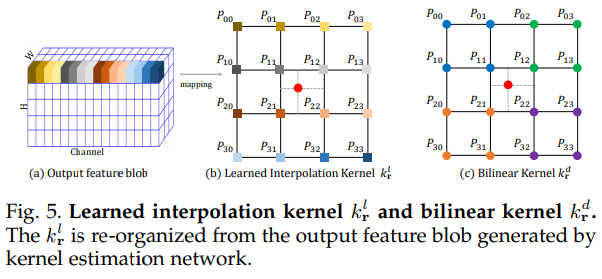

# MEMC-Net
[Motion Estimation and Motion Compensation Driven Neural Network for Video Interpolation and Enhancement](https://arxiv.org/abs/1810.08768) from Shanghai Jiao Tong University
1. exploit **motion estimation and motion compensation** in a neural network 
1. propose an **adaptive warping layer** based on optical flow and compensation filters for synthesizing new pixels. This novel warping layer is fully differentiable such that the gradients can be back-propagated to both the ME and MC networks. 
1. To account for the occlusions, we estimate occlusion masks to adaptively blend the warped frames. Furthermore, the missing pixels in holes and unreliable pixels of the warped frames are processed by a post-processing CNN
1. simultaneously estimate the flow and compensation kernels with respect to the original reference frames, then combine with adaptive warping layer
## Related work

### (a) Conventional MEMC-based approaches
1. Motion Estimation: block-based then search (e.g. spatial/temporal search)
1. Motion Compensated Interpolation: utilize motion to get interpolated frame (e.g. image fusion, overlapped patch reconstruction)
1. Post-processing: remove artifacts
### (b) Learning-based - flow-based
1. Motion Estimation: CNNs ([SPyNet(CVPR 2017)](http://openaccess.thecvf.com/content_cvpr_2017/papers/Ranjan_Optical_Flow_Estimation_CVPR_2017_paper.pdf), [Flownet (ICCV 2015)](https://arxiv.org/abs/1504.06852), [Flownet 2(CVPR 2017)](https://arxiv.org/abs/1612.01925))
    1. predict bi-directional flow: pretrained flow model first, then task-oriented. e.g. [TOFlow(IJCV 2019)](https://arxiv.org/abs/1711.09078)
    2. bilinear warping operation to align input frames based on linear motion models (i.e. Synthesized frame) [Deep Voxel Flow(ICCV 2017)](video_frame_interpolation.md#deep-voxel-flow-iccv-2017), [FIGAN(2017)](https://arxiv.org/abs/1711.06045), [Super SloMo(CVPR 2018)](https://arxiv.org/abs/1712.00080)
1. Bilinear Warpping: blend neighbor pixels based on the sub-pixel shifts
1. Post-processing
### (c) Learning-based - kernel-based
1. Kernel Estimation: estimate spatially-adaptive convolutional kernels for each output pixel
1. Kernel Convolution
e.g. [SepConv(ICCV 2017)](http://openaccess.thecvf.com/content_ICCV_2017/papers/Niklaus_Video_Frame_Interpolation_ICCV_2017_paper.pdf)
## Motion Estimation and Motion Compensation Driven Neural Network
### 3.1 MEMC-Net Framework
  
### 3.2 Adaptive Warping Layer
warps images or feature based on given optical flow and local convolutional kernels  
**Foward pass**  
`$I(x) : \mathbb{Z}^2 \to \mathbb{R}^3$` denote the RGB image (from 2D coordinates to 3 RGB color real value)  
`$f(x):= (u(x),v(x) $` represent the optical flow field, u(x), v(x) denote the horizontal and vertical part of 2D vector  
`$ k^l(x) = [k^l_\mathbf{r}(x)]_{H \times W} (r \in [-R+1,R]^2) $` indicate the interpolation kernel where R is the kernel size  
```math
\hat{I}(x) = \sum_{\mathbf{r} \in [-R+1,R]^2 k_\mathbf{r}(x) I(x+\lfloor f(x)\rfloor+r)}
```  
For each kernel: 
Image part: shift by optical flow + Kernel  
```math
k_\mathbf{r} = k^l_\mathbf{r} k^d_\mathbf{r}
```
`$k^l_\mathbf{r}$`: 16 (maps to 4x4) channels interpolation kernel learned in kernel estimation network  
`$k^d_\mathbf{r}$`: 4x4 coefficients computed from f(x)= u(x), v(x) fractional part  
  
interpolate the 4x4 kernel `$k^l_\mathbf{r}$` with optical flow  
**backward pass**  
compute the gradients with respect to optical flow and interpolation kernels respectively.  I do not understand how to differentiate `$I(x+f(x)+r)$` part… It seems it do not learn optional flow estimation, using pre-trained model directly, in this case adaptive wrapping layer only learn/fine tune the optical flow transform for kernel layer. From Hyper-parameter settings, it only fine tune pre-trained model with low learning rate.

### 3.3 Flow Project Layer
Let `$f_{t_x \to t_y}(x) $` be the motion vector field of coordinate x in frame `$I_{t_x} to I_{t_y}$`
given `$f_{t-1 \to t+1}(y) $`, find `$f_{t \to t-1}(x)$` and `$f_{t \to t+1} $`
Project with outside-in strategy
## 4 video frame interpolation
All 4 branches take `$I_{t-1}, I_{t+1} $`as input

|module            |function/output                                  |architecture|
|------------------|-------------------------------------------------|---|
|Motion estimation |estimate optical flow |FlowNetS|
|Kernel estimation |2 R^2=RxR coefficient maps |U-Net|
|Mask estimation   |2-channel feature map  |U-Net|
|Context extraction|, warp by adaptive warping layer and fed to post-processing| ResNet18(for MEMC-Net*)|
