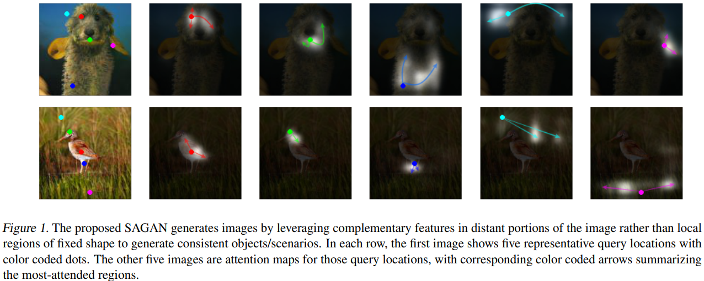
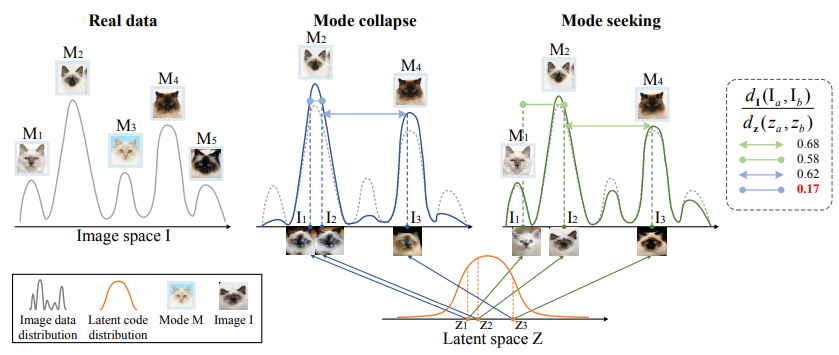

## General

### GAN (NIPS 2014)
[Generative Adversarial Networks](https://arxiv.org/abs/1406.2661) by iangoodfellow  
[Ian Goodfellow NIPS 2016 tutorial](https://arxiv.org/pdf/1701.00160.pdf)| [PPT](http://www.iangoodfellow.com/slides/2016-12-04-NIPS.pdf) 

### DCGAN (ICLR 2016)
[Unsupervised Representation Learning with Deep Convolutional Generative Adversarial Networks](https://arxiv.org/abs/1511.06434)
stabilize the training with some architectural constraints.
* Replace any pooling layers with strided convolutions (discriminator) and fractional-strided convolutions (generator). 
* Use batch normalization in both the generator and the discriminator. 
* Remove fully connected hidden layers for deeper architectures. 
* Use ReLU activation in generator for all layers except for the output, which uses Tanh. 
* Use LeakyReLU activation in the discriminator for all layers. 

### Are GANs Created Equal? A Large-Scale Study (NIPS 2018)
[Are GANs Created Equal? A Large-Scale Study](https://arxiv.org/pdf/1711.10337.pdf) by Google Brain  
> Generative adversarial networks (GAN) are a powerful subclass of generative models. Despite a very rich research activity leading to numerous interesting GAN algorithms, it is still very hard to assess which algorithm(s) perform better than others. We conduct a neutral, multi-faceted large-scale empirical study on state-of-the art models and evaluation measures. We find that **most models can reach similar scores** with enough hyperparameter optimization and random restarts. This suggests that improvements can arise from a higher computational budget and tuning more than fundamental algorithmic changes. To overcome some limitations of the current metrics, we also propose several data sets on which precision and recall can be computed. Our experimental results suggest that future GAN research should be based on more systematic and objective evaluation procedures. Finally, we did not find evidence that any of the tested algorithms consistently outperforms the non-saturating GAN introduced in \cite{goodfellow2014generative}.

### SAGAN (PMLR 2019)
[Self-Attention Generative Adversarial Networks](https://arxiv.org/pdf/1805.08318.pdf)  
learn global, **long-range dependencies** for generating images.  

Background: CNN usually fails to capture geometric or strcutural patterns because long range dependencies processed after passing through several convolutional layers, preventing learning about long-term dependencies for 
1. small model may not be able to represent them
2. optimization algorithms may have trouble discovering parameters value that carefully coordinate multiple layers to capture these dependencies
3. these parameterizations may be statistically brittle and prone to failure when applied to previously unseen inputs
Increasing the size of convolution kernel loses the computational and statistical efficiency

Self-attention: map attention map by transpose (adapt non-local model of [Non-local Neural Network](/basic/attention.html#non-local-neural-networks-cvpr-2018)

> The reason is that self-attention receives more evidence and enjoys more freedom to choose conditions with larger feature maps
(i.e., it is complementary to convolution for large feature maps), however, it plays a similar role as the local convolution when modeling dependencies for small (e.g., 8×8) feature maps. It demonstrates that the attention mechanism gives more power to both the generator and the discriminator to directly model the long-range dependencies in the feature maps. 
##### Application
[DeOldify](https://github.com/jantic/DeOldify) [mention](https://www.reddit.com/r/MachineLearning/comments/9tcfls/p_introducing_deoldify_a_progressive/) self-attention GAN work well.


### Mode Seeking GAN (CVPR 2019)
[Mode Seeking Generative Adversarial Networks for Diverse Image Synthesis](http://openaccess.thecvf.com/content_CVPR_2019/papers/Mao_Mode_Seeking_Generative_Adversarial_Networks_for_Diverse_Image_Synthesis_CVPR_2019_paper.pdf), MSGAN

mode seeking regularization term to directly maximize the ratio of the distance between G(c, z1) and G(c, z2) with respect to the distance between latent code z1 and z2  
```math
L_{ms}=max_G(\frac{d_I(G_(c,z_1), G_(c,z_2))}{d_z(z_1,z_2)})
```
