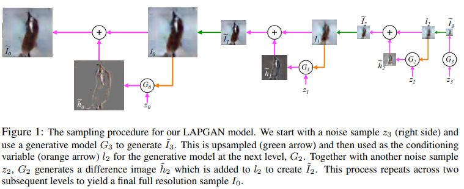

# High Resolution Image GAN

## LAPGAN
[Deep Generative Image Models using a Laplacian Pyramid of Adversarial Networks (NIPS 2015)](https://arxiv.org/abs/1506.05751)  
aim for **high-resolution** image via using low-resolution image as condition, similar to residual learning
> In this paper we introduce a **generative parametric model** capable of producing high quality samples of natural images. Our approach uses **a cascade of convolutional networks** within a **Laplacian pyramid framework** to generate images in a coarse-to-fine fashion. 
Note: Could I consider it as GAN plus residual+GAN based super-resolution?

## Progressive GAN
[Progressive Growing of GANs for Improved Quality, Stability, and Variation (ICLR 2018)](https://arxiv.org/pdf/1710.10196.pdf) by Nvidia  
[Official TensorFlow implementation](https://github.com/tkarras/progressive_growing_of_gans) | [PyTorch implenetation (unofficial)](https://github.com/nashory/pggan-pytorch) | [PyTorch/hub](https://pytorch.org/hub/facebookresearch_pytorch-gan-zoo_pgan/)  
### Growing
resize + w * conv, increase weighting of convolution to fade smoothly  
fully integrate previous learning result into bigger model  
### Normalization
[Pixelwise Feature Vector Normalization](/basic/normalization.html#pixelwise-feature-vector-normalization-iclr-2018) in generator
### Result
<iframe src="https://www.youtube.com/embed/XOxxPcy5Gr4" frameborder="0" allow="accelerometer; autoplay; encrypted-media; gyroscope; picture-in-picture" allowfullscreen></iframe>
### Compare with LAPGAN
Progressive GAN merge the small model into large model. In inference step, Progressive GAN take features as input, LAPGAN take low-resolution image as input

## pix2pixHD (CVPR 2018)
[High-Resolution Image Synthesis and Semantic Manipulation with Conditional GANs](https://arxiv.org/pdf/1711.11585.pdf) by Nvidia + author of pix2pix  
[Project](https://tcwang0509.github.io/pix2pixHD/)
> We present a new method for synthesizing **high-resolution photo-realistic** images from semantic label maps using conditional generative adversarial networks (conditional GANs). Conditional GANs have enabled a variety of applications, but the results are often limited to low-resolution and still far from realistic. In this work, we generate 2048x1024 visually appealing results with a **novel adversarial loss**, as well as new **multi-scale** generator and discriminator architectures. Furthermore, we *extend* our framework to *interactive visual manipulation* with two additional features. First, we incorporate object instance segmentation information, which enables object manipulations such as removing/adding objects and changing the object category. Second, we propose a method to generate diverse results given the same input, allowing users to edit the object appearance interactively. Human opinion studies demonstrate that our method significantly outperforms existing methods, advancing both the quality and the resolution of deep image synthesis and editing.

### Coarse2fine Generator
### Compare with Progressive GAN
* The main idea of both 2 paper is grow the GAN after training low-resolution. Training small generator first, then use a bigger generator include the small generator.  
* pix2pixHD is supervised/conditional while Progressive GAN is un-supervised. pix2pixHD have a encoder in generator while Progressive GAN start with latent input.
* pix2pixHD is handle low-resolution image feature as residual. Progressive GAN fade-out the previous small model and let the big model continus learning the weight.
* When inference with final model, pix2pixHD input high resolution input image + resized low resolution input image(s). Progressive GAN input size remain (latent random noise).  

<!--
Question: What if growing network like Progressive GAN (fade) instead of residual for conditional GAN? Sadly the requirement of training Progressive GAN is high (8 Tesla V100 ;\_;)
-->

### BigGAN
[Large Scale GAN Training for High Fidelity Natural Image Synthesis (ICLR 2019)](https://arxiv.org/abs/1809.11096) by DeepMind  
__TPU advertisement__: 512 TPU  
[PyTorch code](https://github.com/ajbrock/BigGAN-PyTorch) | 
[\[P\] Want to train your own BigGAN on just 4-8 GPUs? Today we're releasing BigGAN-PyTorch](https://www.reddit.com/r/MachineLearning/comments/b461zt/p_want_to_train_your_own_biggan_on_just_48_gpus/)  
high resolution (512x512) output, based on [SA-GAN](#sa-gan-pmlr-2019)  
Not only increase the computation, there are still novel improvement to handle the big GAN.
1. Batch size and regularization
2. **truncation trick**: improve quality of output (trade-of diversity)
3. why big GAn usually not stable and solutions
