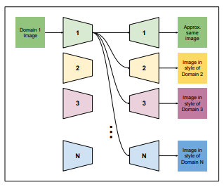
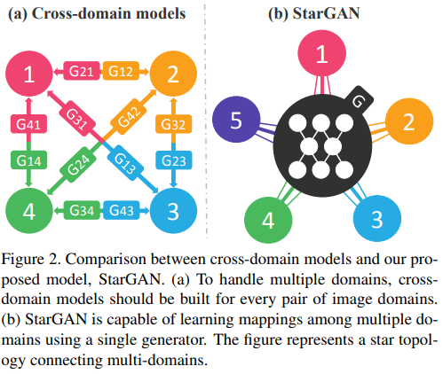

# Two-way GAN
Cycle-consitenty Loss is good for color and texture, but not very succesfull on shape change. For transfer with shape, could check [UNIT](GAN_repersentation_learning.html#unit-nips-2017) and its variants
## CycleGAN
[Unpaired Image-to-Image Translation using Cycle-Consistent Adversarial Networks (ICCV 2017)](https://arxiv.org/abs/1703.10593) by Jun-Yan Zhu, Taesung Park, Phillip Isola, Alexei A. Efros  
[Project](https://junyanz.github.io/CycleGAN/)| 
[Torch](https://github.com/junyanz/CycleGAN) | 
[pyTorch](https://github.com/junyanz/pytorch-CycleGAN-and-pix2pix) | 
[CVPR2018 slides](http://efrosgans.eecs.berkeley.edu/CVPR18_slides/CycleGAN.pdf)  
Could be applyed on any **unapired** datasets (better if two datasets share similar visual content)  


Adversarial Loss
```math
\text{for }G: X \to Y{ and } D_Y, 
\mathfrak{L}_{GAN}(G, D_Y, X, Y) & =\mathbb{E}_{y \sim p_{data}(y)}[log D_Y(y)]       \\
                                 & +\mathbb{E}_{x \sim p_{data}(x)}[log (1-D_Y(G(x))] \\
min_G max_{D_Y} \mathfrak{L}_{GAN}(G, D_Y, X, Y)\\
```
**Cycle Consistency Loss**
```math
\mathfrak{L}_{cyc}(G,F) & = \mathbb{E}_{x \sim p_{data}(x)} [||F(G(x))-x||_1]] \\
                        & + \mathbb{E}_{y \sim p_{data}(y)} [||F(G(y))-y||_1]]
\\
```
Full Objective
```math
\mathfrak{L}(G, F, D_x, D_Y) & = \mathfrak{L}_{GAN}(G, D_Y, X, Y) \\
                             & + \mathfrak{L}_{GAN}(F, D_X, X, Y) \\
                             & + \mathfrak{L}_{cyc}(G,F)          \\
G^*, F^* = arg min_{G, F} max_{D_X, D_Y} \mathfrak{L}(G, F, D_x, D_Y)
```
### my testing
[testing cycleGAN](/blog/cycleGAN.md)
good at color and texture changes, bad at shape
## Other two-way GAN
Dual GAN: [DualGAN: Unsupervised Dual Learning for Image-to-Image Translation (ICCV 2017)](https://arxiv.org/abs/1704.02510)  
DiscoGAN: [Learning to Discover Cross-Domain Relations with Generative Adversarial Networks (ICML 2017)](https://arxiv.org/abs/1703.05192)

## Augmented CycleGAN
[Augmented CycleGAN: Learning Many-to-Many Mappings from Unpaired Data (ICML 2018)](https://arxiv.org/abs/1802.10151)  
[pyTorch (Python2, pyTorch 0.3)](https://github.com/aalmah/augmented_cyclegan) | [Theano re-implementation](https://github.com/justanhduc/AugmentedCycleGAN)  

Apart from generator, also have 2 **encoders** `$E_A: A \times B → Z_a, E_B: B \times A → Z_b$` which enable optimization of cycle-consistency with stochastic, structured mapping  


## Paired CycleGAN
[PairedCycleGAN: Asymmetric Style Transfer for Applying and Removing Makeup (CVPR 2018)](https://adoberesearch.ctlprojects.com/wp-content/uploads/2018/04/CVPR2018_Paper3623_Chang.pdf)  
Could apply specified style from input_reference to input_source, as a one-to-many transformation  
   
pre-train makeup removal function F(many-to-one) with CycleGAN first, then alternate the training of makeup transfer function G (one-to-many)  
Note: Consider as conditional GAN with (input source + input reference) as conditions

## ComboGAN
[ComboGAN: Unrestrained Scalability for Image Domain Translation (CVPR 2018)](http://openaccess.thecvf.com/content_cvpr_2018_workshops/papers/w13/Anoosheh_ComboGAN_Unrestrained_Scalability_CVPR_2018_paper.pdf)  
encoder-decoder pairs that share the latent coding. 


## StarGAN
[StarGAN: Unified Generative Adversarial Networks for Multi-Domain Image-to-Image Translation (CVPR 2018)](https://arxiv.org/abs/1711.09020)  
[pyTorch code](https://github.com/yunjey/stargan)
input mask vector, an one-shot label, the target domain as second input condition

### StarGANv2
[StarGAN v2: Diverse Image Synthesis for Multiple Domains (CVPR 2020)](https://arxiv.org/abs/1912.01865) |
[Github stargan-v2](https://github.com/clovaai/stargan-v2) | 
[Youtube](https://youtu.be/0EVh5Ki4dIY) | 
[Twitter](https://twitter.com/yunjey_choi) | 
[Reddit](https://www.reddit.com/r/MachineLearning/comments/g8s1af/r_clova_ai_researchs_stargan_v2_cvpr_2020_code/)
> Goal: train a **single** generator G that can generate **diverse** images of each domain y that corresponds to the image x. We generate **domain-specific** style vectors in the learned style space of each domain and train G to reflect the style vectors
Replace its domain label with our proposed **domains pecific style code** that can represent diverse styles of a specific domain with 2 modules
1. mapping network: learns to transform random Gaussian noise into a style code
1. style encoder: learns to extract the style code from a given reference image

## Comparison of above 4 conditional variants

|GAN               |condition apply to|the amount of generator/encoder| input                     |
|------------------|---------------|-----------------------|--------------------------------------|
|Augmented CycleGAN| within domain | 2 generators          | source image + encoding              |
|Paired CycleGAN   | within domain | 2 generators          | source image  + reference image      |
|UNIT, ComboGAN    | cross-domains | encoder-decoder pairs | source image (to target encoder)     |
|StarGAN           | cross-domains | 1 generators          | source image + label of target domain|