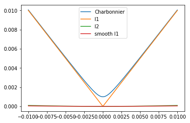

# Loss Functions
## L2 & L1 Loss
### L2 - MSE, Mean Square Error
```math
&L_2(x)=x^2\\
&f(y,\hat{y})=\sum^N_{i=1} (y_i-\hat{y_i})^2
```
Generally, L2 loss converge faster than l1. But it prone to over-smooth for image processing, hence l1 and its variants used for img2img more than l2.
### L1 - MAE, Mean Absolute Error
```math
&L_1(x)=|x|\\
&f(y,\hat{y})=\sum^N_{i=1} |y_i-\hat{y}_i|
```
** MAE seems better than MSE in image generation task, such as super-resolution
### Smooth L1
```math
\text{smooth L}_1(x)=
\begin{cases}
0.5x^2   & if |x|<1 \\
|x|-0.5  & otherwise
\end{cases}
```
```math
&f(y,\hat{y})=
\begin{cases}
0.5(y-\hat{y})^2   & \text{if } |y-\hat{y}|<1 \\
|y-\hat{y}|-0.5    & otherwise
\end{cases}
```
### Charbonnier Loss
LapSRN: [Fast and Accurate Image Super-Resolution with Deep Laplacian Pyramid Networks](http://xxx.itp.ac.cn/pdf/1710.01992)
```math
\text{Charbonnier Loss}(x) = \sqrt{x^2+\epsilon^2}, where \epsilon = 1\times 10^{-3}
```
 

## Regression Loss Functions
### MSE - Mean Squared Error
```math
f(y,\hat{y})=\dfrac{1}{d}\sum^N_{i=1} (y_i-\hat{y}_i)^2
```
### MAE - Mean Absolute Error
```math
f(y,\hat{y})=\dfrac{1}{d}\sum^N_{i=1} |y_i-\hat{y}_i|
```
### MSE - Mean Squared Logarithmic Error
```math
f(y,\hat{y})=\dfrac{1}{d}\sum^N_{i=1} (log(y_i+1)-log(\hat{y}_i+1))^2
```
### Cosine Proximity
```math
\newcommand{\vect}[1]{\boldsymbol{#1}}
f(\vect{y},\hat{\vect{y}})=-\dfrac{\vect{y} \cdot \hat{\vect{y}}}{||\vect{y}||_2 \cdot ||\hat{\vect{y}}||_2}= \dfrac{\Sigma^n_{i=1}y_i\cdot\hat{y}_i}{\sqrt{\sum^n_{i=1}y_i^2}\cdot\sqrt{\sum^n_{i=1}\hat{y}_i^2}}
```

## Binary Classification Loss Functions
### Binary Cross-Entropy
`$\hat{y}$` is prediction, y is ground truth
```math
f(y,\hat{y})=-\dfrac{1}{n}\sum^n_{i=1}[y_i log(\hat{y}_i)+(1-y_i) log(1-\hat{y}_i)]
```
### Hinge Loss
max-margin objective
```math
f(y,\hat{y})=\dfrac{1}{n}\sum^n_{i=1}max(0,m-y_i\cdot\hat{y}_i)
```
### Squared Hinge Loss
```math
f(y,\hat{y})=\dfrac{1}{n}\sum^n_{i=1}(max(0,m-y_i\cdot\hat{y}_i))^2
```

## Multi-Class Classification Loss Functions
### Multi-Class Cross-Entropy Loss
```math
f(y,\hat{y})=-\sum^M_{c=1}y_c log(\hat{y}_c)
```
M: total number of class
### Softmax Loss, Negative Logarithmic Likelihood, NLL
Cross Entropy Loss same as Log Softmax + NULL
Probability of each class
```math
f(s,\hat{y})=-\sum^M_{c=1}\hat{y}_c log(s_c) 
```
`$\hat{y}$` is 1*M vector, the value of true class is 1, other value is 0, hence
```math
f(s,\hat{y})=-\sum^M_{c=1}\hat{y}_c log(s_c) = -log(s_c)
```
, where c is the true label
### Kullback Leibler Divergence Loss
=MLE (Max likelihood estimation)
probability distribution
```math
f(y_i,\hat{y}_i)& =\dfrac{1}{n}\sum^n_{i=1}D_{KL}(y_i||\hat{y}_i)\\
                & =\dfrac{1}{n}\sum^n_{i=1}[y_i\cdot log(\dfrac{y_i}{\hat{y}_i})]\\
                & =\dfrac{1}{n}\sum^n_{i=1}(y_i\cdot log(y_i))-\dfrac{1}{n}\sum^n_{i=1}(y_i\cdot log(\hat{y}_i))
```

## CNN Loss
[Loss Functions for Image Restoration with Neural Networks](https://arxiv.org/pdf/1511.08861.pdf)
### Content Loss
compare pixel by pixel
Blurry results because Euclidean distance is minimized by averaging all plausible output
e.g. MAE, MSE
### Perceptual Loss
[Style Transfer/Perceptual Loss](/CNN/img2img/style_transfer.html#perceptual-loss-eccv-2016)

## Detection
### Focal Loss
[Focal Loss](/CNN/object_detection/focal_loss.md)  

## Face
see [Face Feature Embedding](/CNN/object_detection/face.html#face-feature-embedding)

## Divergence loss (on probability)
measuring the similarity between two probability distributions
### KL-Divergence
### JS-Divergence (Jensen–Shannon divergence)
smoothen version of KL divergence via 
```math
D_{JS}(p||q)=\dfrac{1}{2}D_{KL}(p||\dfrac{p+q}{2})+\dfrac{1}{2}D_{KL}(q||\dfrac{p+q}{2})
```
### Wasserstein distance= Earth-Mover(EM) distance
[WGAN](/GAN.html#wgan-icml-2017)
