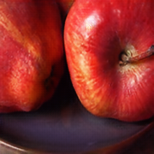
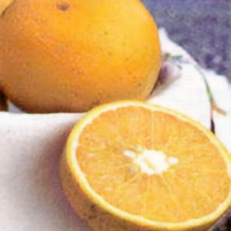
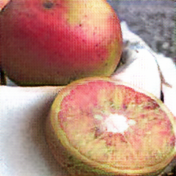

# MMD(CG) -> Anime
[CycleGAN](/generative_models/GAN_image2image.html#cyclegan-iccv-2017)

## Custom dataset that I want to play with
MMD -> human drawed Anime
TODO: need to collect data and parse frame...how much sample is needed? how to handle resolution?
play with cycleGAN's dataset and have a taste first...
## Trying cycleGAN's dataset
sadly I only have a poor RTX 2070, which only could fit 2 batch.
### horse2zebras
Tried pyTorch CycleGAN (Python 3 + pyTorch 1.4) to run horse2zebras, superisingly good :D  Expecially horse2zebras.  

-29/03/2020
zebras2horse is relatively bad comparing to horse2zebras, probably because generator try to keep zebras detail? If continus training, the generator of zebras2horse will try to encode the striped coats into somewhere imperceptible to human(and discriminator based on the loss)?  
There is a paper already discussing this issue: [CycleGAN, a Master of Steganography](https://arxiv.org/abs/1712.02950)  
-31/03/2020
### apple2orange
horse2zebras have almost same shape, what if dataset have different shape? try apple2orange and see if how well cycleGAN could modifiy the shape...
trained 200 epoch, only change color, fail to change shape or inside...  

|real|fake|rec|idt|
|---|---|---|---|
|||||
|||||
continue with more epochs, training...-31/03/2020
ps there is some weird apple...

	new file:   source/blog/img/cycleGAN_apple/apples/n07740461_10842.jpg
	new file:   source/blog/img/cycleGAN_apple/apples/n07740461_11408.jpg
	new file:   source/blog/img/cycleGAN_apple/apples/n07740461_11598.jpg
	new file:   source/blog/img/cycleGAN_apple/apples/n07740461_11917.jpg
	new file:   source/blog/img/cycleGAN_apple/apples/n07740461_14327.jpg
	new file:   source/blog/img/cycleGAN_apple/apples/n07740461_14593.jpg
	new file:   source/blog/img/cycleGAN_apple/apples/n07740461_14767.jpg
	new file:   source/blog/img/cycleGAN_apple/apples/n07740461_14889.jpg
	new file:   source/blog/img/cycleGAN_apple/apples/n07740461_4163.jpg
	new file:   source/blog/img/cycleGAN_apple/apples/n07740461_5067.jpg
	new file:   source/blog/img/cycleGAN_apple/apples/n07740461_7004.jpg
	new file:   source/blog/img/cycleGAN_apple/apples/n07740461_8902.jpg

## TODO experiments
* train cycleGAN in patch manner
* train cycleGAN with small / middle size, so that the receptive field can get more sense of whole image  
* apply super-resolution on above output

With limited GPU resource, is it possible to train a low-resolution cycleGAN, then drop the second generator-discriminator pair to free memory, and use [progressive GAN](/generative_models/GAN_image2image.html#progressive-gan-iclr-2018)/ [pix2pixHD](/generative_models/GAN_image2image.html#pix2pixhd-cvpr-2018) growing method to increase resolution?

* pretrained small cycleGAN + pix2pixHD growing
* pretrained small cycleGAN + progressive GAN growing
- 26/03/2020