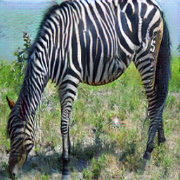
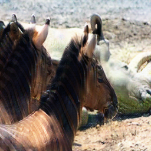
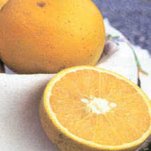
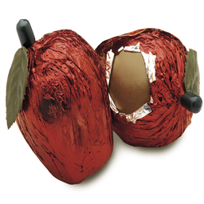
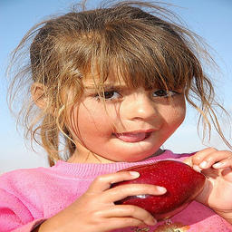
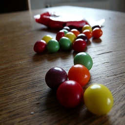
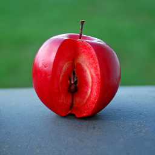
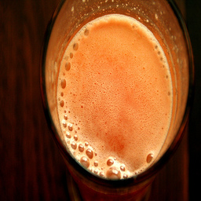
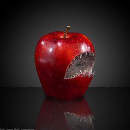

# Blog: test cycleGAN
paper: [CycleGAN](/generative_models/GAN/two-way_GAN.html#cyclegan-iccv-2017)  
I want to apply cycleGAN on some custom dataset. How much sample is needed? How to handle resolution? What is expected result? What's the hardware requirement? Is cycleGAN suitable for this task?  
Play with cycleGAN's dataset and have a taste first.  
sadly I only have a poor RTX 2070, which only could fit 2 batches.
## horse2zebras
Tried pyTorch CycleGAN (Python 3 + pyTorch 1.4) to run horse2zebras, superisingly good :D  Expecially horse2zebras.  
  
zebras2horse is relatively bad comparing to horse2zebras, probably because generator try to keep zebras detail? If continus training, the generator of zebras2horse will try to encode the striped coats into somewhere imperceptible to human (and discriminator based on the loss function)?  
There is a paper already discussing this issue: [CycleGAN, a Master of Steganography](https://arxiv.org/abs/1712.02950)  
-31/03/2020
## apple2orange
horse2zebras have almost same shape, what if dataset have different shape? try apple2orange and see if how well cycleGAN could modifiy the shape...

|real|fake|rec|idt|
|---|---|---|---|
|||||
|||||

trained 200 epochs, only change color and texture, fail to change shape. :(  
Btw, there is some weird apple in the dataset...  

  

## Failure cases
According to [cycleGAN#failure-cases](https://github.com/junyanz/CycleGAN#failure-cases)
> On translation tasks that involve **color and texture changes**, like many of those reported above, the method often succeeds. We have also explored tasks that require **geometric changes, with little success**.
  

## Other test cases
[GANで犬を猫にできるか~cycleGAN編(1)~](https://qiita.com/itok_msi/items/b6b615bc28b1a720afd7#%E8%BF%BD%E5%8A%A0%E5%AE%9F%E9%A8%93%E7%B5%90%E6%9E%9C20170614%E8%BF%BD%E8%A8%987)
tok_msi produced cats ↔ dogs CycleGAN results with a local+global discriminator and a smaller cycle loss.

## Possible improvements
Aim: GAN learning shape from unpaired dataset, drop unnessary info

Possible improvement methods/ direction based on above obversations, reviews and other papers.
1. reduce the cycle consistency loss
1. For cycle consistency loss, use perceptual loss such as VGG or discriminator of source domain instead of L1
1. global + local discriminator
1. Attention
1. train small image instead of cropped patch, then increase resolution via pix2pixHD or Progressive GAN

-- 04/04/2020