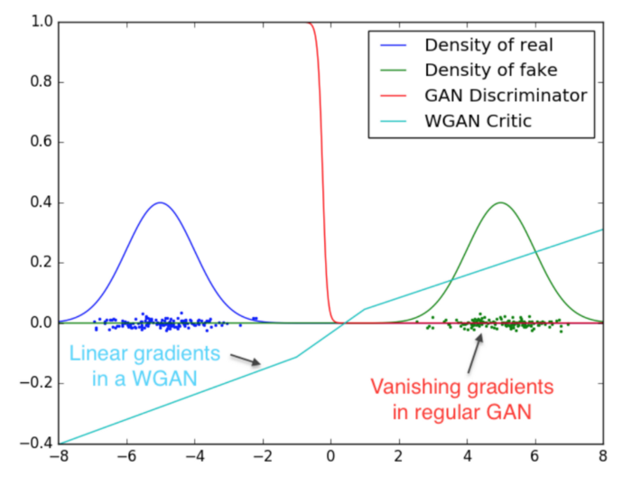

# GAN

* [Repersentation Learning with GAN](/generative_models/GAN_repersentation_learning.md)
* [image-to-image GAN](/generative_models/GAN_image2image.md)
* [GAN for data augmentation](/generative_models/GAN_for_data_augmentation.md)
* [Adversarial Attacks](/generative_models/adversarial_attacks.md)

## General
[Generative Adversarial Networks](https://arxiv.org/abs/1406.2661) (NIPS 2014) by iangoodfellow  
[Ian Goodfellow NIPS 2016 tutorial](https://arxiv.org/pdf/1701.00160.pdf)| [PPT](http://www.iangoodfellow.com/slides/2016-12-04-NIPS.pdf) 

### DCGAN
[DCGAN (ICLR 2016)](/generative_models/GAN_repersentation_learning.md#dcgan-iclr-2016)

### LSGAN
[Least Squares Generative Adversarial Networks](https://arxiv.org/abs/1611.04076)  
adopt least squares loss function for the discriminator, which yeilds minimizing the Pearson x^2 divergence  
Notes: [Gapeng](https://zhuanlan.zhihu.com/p/25768099) said change the loss in DCGAN without modification of model architecture do not imporve result

### WGAN (ICML 2017)
[Towards Principled Methods for Training Generative Adversarial Networks](https://arxiv.org/abs/1701.04862)
[Wasserstein GAN](https://arxiv.org/abs/1701.07875)  
improve the stability of learning by using Wasserstein-1 distance. 
##### Wasserstein distance= Earth-Mover(EM) distance
KL, JS divegence is discontinue, not stable when training nerual network; introduce **WS divegence**, which is continues.  
the minimum cost of transporting mass in converting the data distribution q to the data distribution p  
solve: vanishing gradients in GAN casued by good discriminator + bad generator  

##### Apart from Wasserstein-1 distance:
* No log in the loss. The output of D is no longer a probability, hence we do not apply sigmoid at the output of D
* Clip the weight of D (0.01)
* Train D more than G (5:1)
* Do not use optimator based on momentum. Use RMSProp instead of ADAM. (SGD is also okay)
* Lower learning rate (0.00005)
#### WGAN-GP (NIPS 2017)
[Improved Training of Wasserstein GANs](https://arxiv.org/abs/1704.00028)
WGAN issue: weight clipping to force continues
contrib: gradient penalty
* do NOT use batch noramlization

### Are GANs Created Equal? A Large-Scale Study (NIPS 2018)
[Are GANs Created Equal? A Large-Scale Study](https://arxiv.org/pdf/1711.10337.pdf) by Google Brain  
> Generative adversarial networks (GAN) are a powerful subclass of generative models. Despite a very rich research activity leading to numerous interesting GAN algorithms, it is still very hard to assess which algorithm(s) perform better than others. We conduct a neutral, multi-faceted large-scale empirical study on state-of-the art models and evaluation measures. We find that **most models can reach similar scores** with enough hyperparameter optimization and random restarts. This suggests that improvements can arise from a higher computational budget and tuning more than fundamental algorithmic changes. To overcome some limitations of the current metrics, we also propose several data sets on which precision and recall can be computed. Our experimental results suggest that future GAN research should be based on more systematic and objective evaluation procedures. Finally, we did not find evidence that any of the tested algorithms consistently outperforms the non-saturating GAN introduced in \cite{goodfellow2014generative}.

### SN-GAN (ICLR 2018)
[Spectral Normalization for Generative Adversarial Networks](https://openreview.net/pdf?id=B1QRgziT-)  
> One of the challenges in the study of generative adversarial networks is the instability of its training. In this paper, we propose a *novel weight normalization technique* called **spectral normalization** to **stabilize the training of the discriminator**. Our new normalization technique is computationally light and easy to incorporate into existing implementations. We tested the efficacy of spectral normalization on CIFAR10, STL-10, and ILSVRC2012 dataset, and we experimentally confirmed that spectrally normalized GANs (SN-GANs) is capable of generating images of better or equal quality relative to the previous training stabilization techniques.

### Projection Discriminator (ICLR 2018)
[cGANS with Projection Discriminator](https://openreview.net/pdf?id=ByS1VpgRZ)  
> We propose a novel, *projection based* way to **incorporate the conditional information into the discriminator** of GANs that respects the role of the conditional information in the underlining probabilistic model. This approach is in contrast with most frameworks of conditional GANs used in application today, which use the conditional information by concatenating the (embedded) conditional vector to the feature vectors. With this modification, we were able to significantly improve the quality of the class conditional image generation on ILSVRC2012 (ImageNet) 1000-class image dataset from the current state-of-the-art result, and we achieved this with a single pair of a discriminator and a generator. We were also able to extend the application to super-resolution and succeeded in producing highly discriminative super-resolution images. This new structure also enabled high quality category transformation based on parametric functional transformation of conditional batch normalization layers in the generator. 
[code](https://github.com/pfnet-research/sngan_projection)

### SAGAN (PMLR 2019)
[Self-Attention Generative Adversarial Networks](https://arxiv.org/pdf/1805.08318.pdf)  
Benefiting from the self-attention mechanism, SAGAN is able to learn global, long-range dependencies for generating images. SAGAN improve IS score.

### BigGAN (ICLR 2019)
[Large Scale GAN Training for High Fidelity Natural Image Synthesis](https://arxiv.org/abs/1809.11096)
__TPU advertisement__  
Not only increase the computation, there are still novel improvement to handle the big GAN.  
I am too poor to read it. #TODO  

## Challenges
### Mode Collapse / Mode Diversity
generator collapses, produces limited varieties of sample to fake discrimator
cuased by: dimension deficient
solutions:  generalized dataset, Orthonormal constraint (正交約束), diversity loss (e.g. multi-scale structural similarity (MS-SSIM))
### Non-convergence, Convergence difficulty
the model parameters oscillate, destabilize
### Vanishing gradient because of too good discriminator
the discriminator gets too successful that the generator gradient vanishes and learns nothing
solution: [WGAN - Wasserstein distance]()
### Image quality