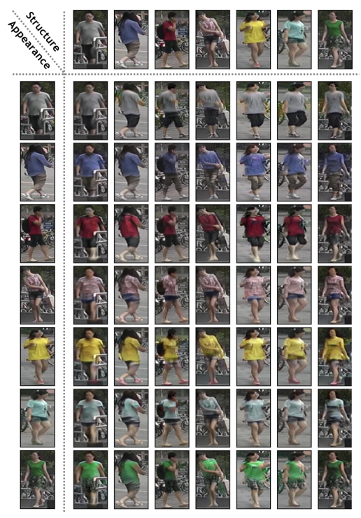
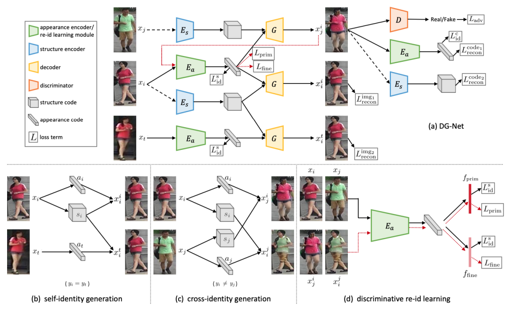

# GAN_for_Data_Augmentation
Current quality of GAN seems not really improve model...but it is a new area to be explored.
Just list some paper

[The Effectiveness of Data Augmentation in Image Classification using Deep Learning](https://arxiv.org/abs/1712.04621)
Sadly, seems that GAN-based data augmentation is not better than tranditional data augmentation

## Adversarial Domain Adaptation

||mean IOU|Per-pixel accuracy|
|---|---|---|
|Oracle (Train and test on Real)|60.3|93.1|
|Train on CG, test on Real      |17.9|54.0|
|Train on CycleGAN, test on Real|**34.8**|**82.8**|

## Person-reID GAN (ICCV 2017)
[Unlabeled Samples Generated by GAN Improve the Person Re-identification Baseline in vitro](https://arxiv.org/abs/1701.07717) 
### (label smoothing regularization for outliers) LSRO
use GAN generate new (negative) input, assigns a **uniform label distribution** to the unlabeled images, which regularizes the supervised model and improves the baseline.

## BAGAN
[BAGAN: Data Augmentation with Balancing GAN](https://arxiv.org/pdf/1803.09655.pdf)  
> The generative model learns useful features from majority classes and uses these to generate images for minority classes. We apply **class conditioning in the latent space** to drive the generation process towards a target class. The generator in the GAN is initialized with the encoder module of an **autoencoder** that enables us to learn an accurate class-conditioning in the latent space. 
## DeLiGAN (CVPR 2017)
[DeLiGAN : Generative Adversarial Networks for Diverse and Limited Data](https://arxiv.org/pdf/1706.02071.pdf)  
when data is limited yet originates from a diverse image modality, increasing the network depth becomes infeasible. 
* enhance intra-class diversity
> Instead of increasing the model depth, we propose to increase the modelling power of the **prior distribution**. In particular, we propose a **reparameterization of the latent space** as a **Mixtureof-Gaussians model**
### reparameterization trick
[VAE]

## VERI-Wild (CVPR 2019)
[VERI-Wild: A Large Dataset and a New Method for Vehicle Re-Identification in the Wild](http://openaccess.thecvf.com/content_CVPR_2019/papers/Lou_VERI-Wild_A_Large_Dataset_and_a_New_Method_for_Vehicle_CVPR_2019_paper.pdf)
[Embedding adversarial learning for vehicle re-identification](https://www.researchgate.net/publication/331158735_Embedding_Adversarial_Learning_for_Vehicle_Re-Identification)  
1. collect new dataset
2. propose a new method for vehicle ReID 
### Feature Distance Adversarial Network (FDA-Net) 
> a novel feature distance adversary scheme is designed to online generate **hard negative samples in feature space**.

## FD-GAN: Pose-guided feature distilling GAN for robust person re-identification (NIPS 2018)
Pose-guided
## Multi-pseudo regularized label for generated samples in person re-identification. (TIP 2018)

## Pose transferrable person re-identification (CVPR 2018)
Pose-guided
##  Pose-normalized image generation for person re-identification (ECCV 2018)

## DG-Net (2019)
[Joint Discriminative and Generative Learning for Person Re-identification](https://arxiv.org/pdf/1904.07223.pdf)
> In this paper, we seek to improve learned re-id embeddings by better leveraging the generated data. To this end, we propose a **joint learning framework that couples re-id learning and data generation end-to-end**. Our model involves a generative module that **separately encodes each person into an appearance code and a structure code**, and a discriminative module that **shares the appearance encoder** with the generative module. By switching the appearance or structure codes, the generative module is able to generate high-quality cross-id composed images, which are online fed back to the appearance encoder and used to improve the discriminative module.   

## Recover and identify: A generative dual model for cross-resolution person re-identification