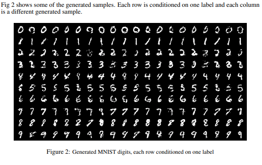
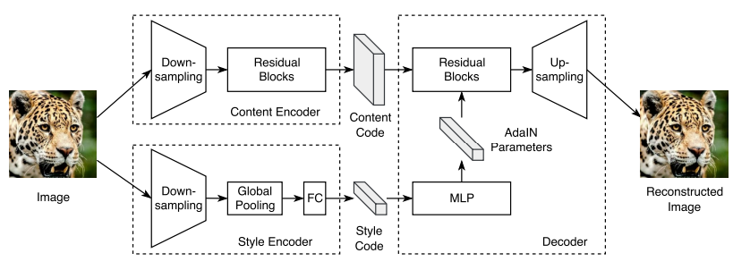

# Repersentation Learning with GAN
Apply condition, interactive/editing
### Conditional GAN (2014)
[Conditional Generative Adversarial Nets](https://arxiv.org/abs/1411.1784) by Mehdi Mirza, Simon Osindero  
Apply GAN by learning conditions (supervised)  

  
Applications shown in paper: genetarte MNIST digits (from noise+condition that specified digit number) & image tagging  
Image-to-image translation model like pix2pix could be considiered conditional GAN, with image input as condition.  

### DCGAN (ICLR 2016)
[Unsupervised Representation Learning with Deep Convolutional Generative Adversarial Networks](https://arxiv.org/abs/1511.06434)
stabilize the training with some architectural constraints.
* Replace any pooling layers with strided convolutions (discriminator) and fractional-strided convolutions (generator). 
* Use batch normalization in both the generator and the discriminator. 
* Remove fully connected hidden layers for deeper architectures. 
* Use ReLU activation in generator for all layers except for the output, which uses Tanh. 
* Use LeakyReLU activation in the discriminator for all layers. 
Applications:
vector arithmetic on face samples and control of bedroom (repersentation learning)

### InfoGAN (NIPS 2016)
[InfoGAN: Interpretable Representation Learning by Information Maximizing Generative Adversarial Nets](https://arxiv.org/abs/1606.03657)
Apply GAN with learning conditions

### iGAN (2016~2017)
[Generative Visual Manipulation on the Natural Image Manifold](https://arxiv.org/abs/1609.03552) - Adobe  
[Theano](https://github.com/junyanz/iGAN)  
>  learn the natural image manifold directly from data using a generative adversarial neural network. We then define a class of image editing operations, and constrain their output to lie on that learned manifold at all times.

architecture based on [DCGAN](#dcgan-iclr-2016)

####  Manipulating the Latent Vector
Each editing operation is formulated as a constraint ``$`f_g(x)=v_g`$``, g include color, shape and warping constraints  
given an initial projection ``$`x_0`$``, find a new image x close to ``$`x_0`$`` trying to satisfy as many constraint as possible via **Gradient descent update** (just like style-transfer, training 1 model for specified loss)  

#### Applications
1. Manipulating an existing photo based on an underlying generative model to achieve a different look (shape and color);
1. “Generative transformation” of one image to look more like another; 
1. Generate a new image from scratch based on user’s scribbles and warping UI.
feature mapping, mini-batch discrimination  

### StyleGAN (CVPR 2019)
[A Style-Based Generator Architecture for Generative Adversarial Networks](https://arxiv.org/abs/1812.04948) by Nvidia  
[links](https://nvlabs.github.io/stylegan2/versions.html)
The generator starts from a learned constant input and adjusts the “style” of the image at **each convolution layer based on the latent code**, therefore directly controlling the strength of image **features at different scales**.

<iframe src="https://www.youtube.com/embed/kSLJriaOumA" frameborder="0" allow="accelerometer; autoplay; encrypted-media; gyroscope; picture-in-picture" allowfullscreen></iframe>

#### StyleGAN2
[Analyzing and Improving the Image Quality of StyleGAN](https://arxiv.org/abs/1912.04958)  
<iframe src="https://www.youtube.com/embed/c-NJtV9Jvp0" frameborder="0" allow="accelerometer; autoplay; encrypted-media; gyroscope; picture-in-picture" allowfullscreen></iframe>

## UNIT (NIPS 2017)
[Unsupervised Image-to-Image Translation Networks](https://arxiv.org/abs/1703.00848) by Nvidia  
Seperate the generator of GAN into encoder+decoder pairs, just like VAE.  
Shared-latent space constraint implies the cycle-consistency constraint.  
VAE+GAN+**weight-sharing**-share weight of last layer of E1 and E2; also share the first layer of G1, G2  
  
Cycle-consistency is not necessary for this task, however, preformance: proposed(UNIT-shared latent space + cycle-consistency) > cycleGAN > shared latent space (VAE-GAN)  
comparing with cycleGAN, it learn shape better.  
### MUNIT (ECCV 2018)
[Multimodal Unsupervised Image-to-Image Translation](https://arxiv.org/abs/1804.04732)  
seperate latent code into content code and style code  
style is embedded in hidden layer of generator  

### DRIT (ECCV 2018)
[Diverse Image-to-Image Translation via Disentangled Representations](https://arxiv.org/abs/1808.00948)  
[Project](http://vllab.ucmerced.edu/hylee/DRIT_pp/) | [Pytorch 0.4.0](https://github.com/HsinYingLee/DRIT/)  
concurrent works of MUNIT  
keep weight sharing of UNIT, add content adversarial loss to force content generator produce encoding that could not be distingished, same concept of [Transfer Learning/DANN](/transfer_learning/index.html#dann-nips-2014)