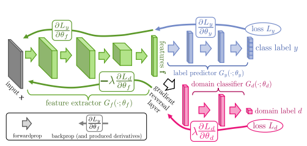

# Transfer Learning
[How transferable are features in deep neural networks? (NIPS 2014)](https://arxiv.org/abs/1411.1792)  
Example: Given labelled grey-scaled MNIST and unlabeled color MNIST, want to train model for classifier of color MNIST without labelling color MNIST.  

## STL
[Self-taught learning: transfer learning from unlabeled data (NIPS 2007)](http://ai.stanford.edu/~hllee/icml07-selftaughtlearning.pdf)  
train classifier with feature representation (e.g. with auto-encoder)

## DaNN (PRICAI 2014)
[Domain Adaptive Neural Networks for Object Recognition (PRICAI 2014)](https://arxiv.org/pdf/1409.6041.pdf)  
**Maximum Mean Discrepancy (MMD)** is a measure of the difference between two probability distributions from their samples. It is an effective criterion that compares distributions without initially estimating their density functions.

## DDC
[**Deep domain confusion**: Maximizing for domain invariance (2014)](https://arxiv.org/abs/1412.3474)  
adaptation layer along with a domain confusion loss based on MMD

## Distillistion
Train big model first, then use it as teacher to teach small model (with faster inference speed)
1. [Do Deep Nets Really Need to be Deep (NIPS 2014)](https://arxiv.org/abs/1312.6184) learn value before softmax, could add some unlabelled data
1. [Distilling the Knowledge in a Neural Network(NIPS 2014)](https://arxiv.org/abs/1503.02531) learn soft target
Better than training small model with labelled data directly. Probably because distillisaton prevent overfit
### Feature Mimicking
[Mimicking Very Efficient Network for Object Detection (CVPR 2017)](http://openaccess.thecvf.com/content_cvpr_2017/papers/Li_Mimicking_Very_Efficient_CVPR_2017_paper.pdf)

## DAN
[Learning Transferable Features with Deep Adaptation Networks (ICML 2015)](https://arxiv.org/abs/1502.02791)  
multi adaptation layers, multi-MMD ([A Kernel Two-Sample Test (JMLR 2012)](http://jmlr.csail.mit.edu/papers/v13/gretton12a.html))

## DANN
[Domain-Adversarial Neural Networks (NIPS 2014)](https://arxiv.org/abs/1412.4446) - Hana Ajakan  
[Unsupervised Domain Adaptation by Backpropagation (ICML 2015)](https://arxiv.org/pdf/1409.7495.pdf) - Yaroslav Ganin  
[Domain-Adversarial Training of Neural Networks (JMLR 2016)](https://arxiv.org/abs/1505.07818) - Yaroslav Ganin, Hana Ajakan  

|module           | function|
|-----------------|---------|
|feature extractor| model to be transfered and tunned|
|label predictor  | predict output|
|doman classifier | identify if target input within source input domain. If clasifier distinguish as new domain, high loss-> force feature extractor learn to mix 2 domain|

## DSN
[Domain separation networks (NIPS 2016)](https://arxiv.org/pdf/1608.06019.pdf)

<!--
### SLA ()
[Distant domain transfer learning](https://www.ntu.edu.sg/home/sinnopan/publications/[AAAI17]Distant%20Domain%20Transfer%20Learning.pdf)
**Selective learning algorithm** with supervised autoencoder as a base model for handling different types of inputs. Intuitively, the SLA algorithm selects usefully unlabeled data gradually from intermediate domains as a bridge to break the large distribution gap for transferring knowledge between two distant domains.  
(Different from STL: STL is uniform, SLA select sample that close to target domain)
-->

### CDAN
[Conditional Adversarial Domain Adaptation (NIPS 2018)](https://arxiv.org/abs/1705.10667)